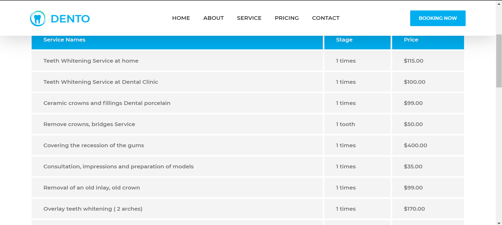

# Django-Dentist-Website
*This is a Dentist Website using Django and SQLite.   In this project you'll learn to build websites with Python and Django by building out a cool and professional Dentist website! In this project you'll learn to build websites fast using free HTML templates.  I downloaded a dental template for free and then customize it to suit my needs.*

**[Live Demo](http://omar022.herokuapp.com/)**

# Features
* Dentist can use this website.
* Patients can see doctors list.
* Can place an appoinment.
* Can contact with doctor or staff.
* User-friendly.

# Tools
## Front-end Part
* HTML
* CSS
* Bootstrap
* JavaScript
## Back-end
* Django
* SQLite 3

# Screenshots of the Project

  
  
  
  
  

**Copyright ©** 2020-3020 Md. Omar Faruk

## Go Through This Site Then You Will Know About This Site Properly.
